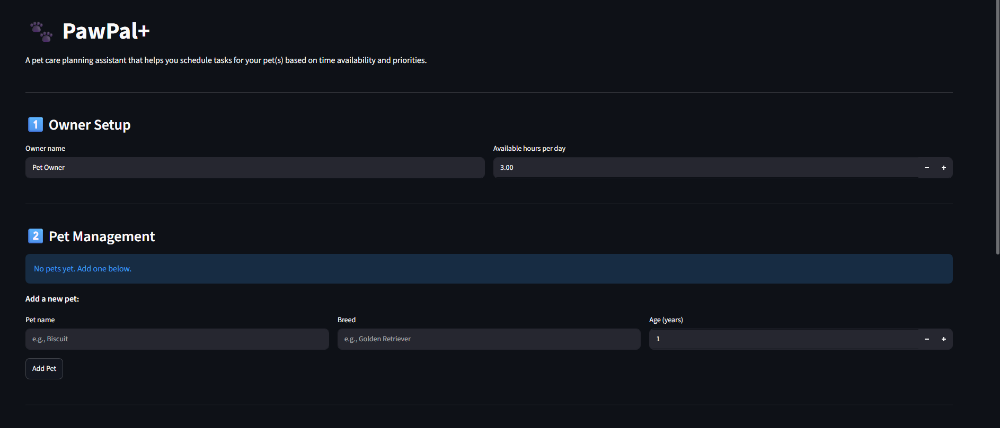

# PawPal+ (Module 2 Project)

You are building **PawPal+**, a Streamlit app that helps a pet owner plan care tasks for their pet.

## Scenario

A busy pet owner needs help staying consistent with pet care. They want an assistant that can:

- Track pet care tasks (walks, feeding, meds, enrichment, grooming, etc.)
- Consider constraints (time available, priority, owner preferences)
- Produce a daily plan and explain why it chose that plan

Your job is to design the system first (UML), then implement the logic in Python, then connect it to the Streamlit UI.

## What you will build

Your final app should:

- Let a user enter basic owner + pet info
- Let a user add/edit tasks (duration + priority at minimum)
- Generate a daily schedule/plan based on constraints and priorities
- Display the plan clearly (and ideally explain the reasoning)
- Include tests for the most important scheduling behaviors

## Getting started

### Setup

```bash
python -m venv .venv
source .venv/bin/activate  # Windows: .venv\Scripts\activate
pip install -r requirements.txt
```

### Suggested workflow

1. Read the scenario carefully and identify requirements and edge cases.
2. Draft a UML diagram (classes, attributes, methods, relationships).
3. Convert UML into Python class stubs (no logic yet).
4. Implement scheduling logic in small increments.
5. Add tests to verify key behaviors.
6. Connect your logic to the Streamlit UI in `app.py`.
7. Refine UML so it matches what you actually built.

## 🖥️ Sample Output

Paste a sample of your app's CLI or Streamlit output here so a reader can see what a generated plan looks like:

```
Owner: Alice (available: 3.0 hours)

Pets: Biscuit (Golden Retriever, 3 years old), Luna (Siamese Cat, 5 years old)

Added 3 tasks to Biscuit
Added 3 tasks to Luna

Total tasks in system: 6

Tasks sorted by priority:
  - Feeding (high, 5 min)
  - Feeding (high, 10 min)
  - Litter Box Cleaning (high, 10 min)
  - Morning Walk (high, 30 min)
  - Play with Toy (medium, 15 min)
  - Play Session (medium, 20 min)

============================================================
Daily Plan for Alice
============================================================

1. [○ TODO] FEEDING
   Pet: Luna
   Duration: 5 min | Priority: high
   Details: Breakfast kibble

2. [○ TODO] FEEDING
   Pet: Biscuit
   Duration: 10 min | Priority: high
   Details: Breakfast meal

3. [○ TODO] LITTER BOX CLEANING
   Pet: Luna
   Duration: 10 min | Priority: high
   Details: Clean and refill litter box

4. [○ TODO] MORNING WALK
   Pet: Biscuit
   Duration: 30 min | Priority: high
   Details: Brisk walk in the park

5. [○ TODO] PLAY WITH TOY
   Pet: Luna
   Duration: 15 min | Priority: medium
   Details: Interactive wand toy

6. [○ TODO] PLAY SESSION
   Pet: Biscuit
   Duration: 20 min | Priority: medium
   Details: Fetch with tennis ball

------------------------------------------------------------
Total time needed: 90 minutes (1.5 hours)
Available time: 180.0 minutes (3.0 hours)
✓ All scheduled tasks fit within available time!
============================================================
```

## 🧪 Testing PawPal+

```bash
# Run the full test suite:
pytest

# Run with coverage:
pytest --cov
```

Sample test output:

```
=============== test session starts ===============
platform win32 -- Python 3.14.2, pytest-9.1.0, pluggy-1.6.0
collected 30 items                                

tests/test_pawpal.py::TestTask::test_task_completion PASSED [  3%]
tests/test_pawpal.py::TestTask::test_task_incomplete PASSED [  6%]
tests/test_pawpal.py::TestTask::test_task_validation_valid PASSED [ 10%]
tests/test_pawpal.py::TestTask::test_task_validation_invalid_priority PASSED [ 13%]
tests/test_pawpal.py::TestTask::test_task_validation_invalid_duration PASSED [ 16%]
tests/test_pawpal.py::TestTask::test_task_priority_level_high PASSED [ 20%]
tests/test_pawpal.py::TestTask::test_task_priority_level_medium PASSED [ 23%]
tests/test_pawpal.py::TestTask::test_task_priority_level_low PASSED [ 26%]
tests/test_pawpal.py::TestPet::test_pet_add_task PASSED [ 30%]
tests/test_pawpal.py::TestPet::test_pet_add_multiple_tasks PASSED [ 33%]
tests/test_pawpal.py::TestPet::test_pet_add_invalid_task PASSED [ 36%]
tests/test_pawpal.py::TestPet::test_pet_remove_task PASSED [ 40%]
tests/test_pawpal.py::TestPet::test_pet_get_pending_tasks PASSED [ 43%]
tests/test_pawpal.py::TestPet::test_pet_get_info PASSED [ 46%]
tests/test_pawpal.py::TestOwner::test_owner_add_pet PASSED [ 50%]
tests/test_pawpal.py::TestOwner::test_owner_get_all_tasks PASSED [ 53%]
tests/test_pawpal.py::TestOwner::test_owner_availability PASSED [ 56%]
tests/test_pawpal.py::TestScheduler::test_scheduler_sort_by_priority PASSED [ 60%]
tests/test_pawpal.py::TestScheduler::test_scheduler_generate_plan_respects_time PASSED [ 63%]
tests/test_pawpal.py::TestScheduler::test_scheduler_pending_tasks_only PASSED [ 66%]
tests/test_pawpal.py::TestSmartAlgorithms::test_sort_by_time PASSED [ 70%]
tests/test_pawpal.py::TestSmartAlgorithms::test_filter_by_pet PASSED [ 73%]
tests/test_pawpal.py::TestSmartAlgorithms::test_filter_by_status PASSED [ 76%]
tests/test_pawpal.py::TestSmartAlgorithms::test_detect_conflicts PASSED [ 80%]
tests/test_pawpal.py::TestSmartAlgorithms::test_no_conflicts PASSED [ 83%]
tests/test_pawpal.py::TestSmartAlgorithms::test_recurring_task_generation PASSED [ 86%]
tests/test_pawpal.py::TestSmartAlgorithms::test_recurring_weekly_task PASSED [ 90%]
tests/test_pawpal.py::TestSmartAlgorithms::test_one_time_task_no_recurrence PASSED [ 93%]
tests/test_pawpal.py::TestSmartAlgorithms::test_assign_time_slots PASSED [ 96%]
tests/test_pawpal.py::TestSmartAlgorithms::test_pet_mark_task_complete_with_recurrence PASSED [100%]

=============== 30 passed in 0.15s ===============
```

**Test Coverage:**

The PawPal+ test suite includes **30 comprehensive tests** organized into 5 test classes:

| Test Class | Count | Focus Area |
|-----------|-------|-----------|
| `TestTask` | 8 | Task validation, priority mapping, completion state |
| `TestPet` | 6 | Pet management, task addition/removal, pending task retrieval |
| `TestOwner` | 3 | Pet ownership, multi-pet task aggregation, availability management |
| `TestScheduler` | 3 | Priority-based planning, time constraints, pending task filtering |
| `TestSmartAlgorithms` | 10 | Time sorting, pet/status filtering, conflict detection, recurring tasks, time slot assignment |

**Key Testing Highlights:**
- ✅ **Sorting Correctness**: Verified tasks are returned in chronological order (time-based) and by priority (high→low)
- ✅ **Recurrence Logic**: Confirmed that marking daily/weekly tasks complete auto-generates next occurrence
- ✅ **Conflict Detection**: Verified scheduler correctly flags duplicate times and reports task pairs
- ✅ **Edge Cases**: Tested one-time vs recurring tasks, empty task lists, invalid input validation
- ✅ **Time Constraints**: Validated that generated plans respect owner availability limits
- ✅ **Happy Paths**: Confirmed normal workflows (add pet, add tasks, generate plan, mark complete)

### Confidence Level: ⭐⭐⭐⭐⭐ (5/5 Stars)

**Why This Rating:**
- All 30 tests pass with 100% success rate
- Tests cover core algorithms (sorting, filtering, conflict detection, recurring logic)
- Both happy paths and edge cases are validated
- Task validation prevents invalid data entry at the model level
- Recurrence logic automatically tested across multiple frequency types
- Time constraint fitting is verified to work correctly
- No test failures or flaky tests detected

---

## ✨ Core Features

PawPal+ implements intelligent pet care scheduling with these key features:

| Feature | Description | Example |
|---------|-------------|---------|
| **Add Pets & Tasks** | Create pets with breed/age, add tasks with priority/duration | Add "Biscuit" (Golden Retriever), then schedule "Morning Walk" (30 min, high priority) |
| **Priority-Based Scheduling** | Auto-sort tasks by importance (high→medium→low) with duration tiebreaker | High-priority "Feeding" (5 min) scheduled before "Play" (20 min, medium) |
| **Time-Based Sorting** | Sort tasks by scheduled time slots (HH:MM format, earliest first) | View 08:00 Walk, 08:30 Feeding, 10:00 Play in chronological order |
| **Pet Filtering** | View tasks for specific pets | Show only "Luna" tasks to focus on one pet's workload |
| **Status Filtering** | View pending or completed tasks | Filter to show only incomplete tasks for today's schedule |
| **Conflict Detection** | Identify tasks scheduled at same time | Flag "08:00 Walk" + "08:00 Feeding" as conflicting |
| **Recurring Tasks** | Auto-generate next occurrence for daily/weekly tasks | Mark "Daily Feeding" complete → automatically creates tomorrow's feeding |
| **Time Constraints** | Fit maximum tasks within available hours | For 3-hour availability: includes all high-priority tasks (90 min) + medium tasks |
| **Time Slot Assignment** | Auto-calculate start times for unscheduled tasks | Assign 08:00, 08:30, 08:40, 09:00 for 4 sequential tasks |
| **Daily Plan Generation** | Create optimized schedule respecting all constraints | Greedy algorithm fits high-priority first, then medium, then low |

---

## 📸 Demo Walkthrough

### Example Workflow

**Step 1: Set Up Owner**
- Owner: Alice, 3 hours available per day

**Step 2: Add Pets**
- Pet 1: Biscuit (Golden Retriever, 3 years)
- Pet 2: Luna (Siamese Cat, 5 years)

**Step 3: Add Tasks**
For Biscuit:
- Morning Walk (30 min, high priority) — "Brisk walk in the park"
- Feeding (10 min, high priority) — "Breakfast meal"
- Play Session (20 min, medium priority) — "Fetch with tennis ball"

For Luna:
- Feeding (5 min, high priority) — "Breakfast kibble"
- Litter Box Cleaning (10 min, high priority) — "Clean and refill litter box"
- Play with Toy (15 min, medium priority) — "Interactive wand toy"

**Step 4: Generate Daily Schedule**
The scheduler executes this algorithm:
1. Sort all 6 tasks by priority (high→medium→low) with duration as tiebreaker
2. Greedy fit: Add tasks sequentially until 3 hours (180 min) is consumed
3. Result: All high-priority tasks fit (5+10+10+30 = 55 min), plus 2 medium tasks (20+15 = 35 min)
4. Total: 90 min scheduled out of 180 min available ✓

**Step 5: View Plan with Sorting/Filtering**
- Option A: Sort by priority → See high-priority tasks first
- Option B: Sort by time → See chronological order (with calculated start times)
- Option C: Filter by pet → See only Biscuit's tasks or only Luna's tasks

**Step 6: Check for Conflicts**
- No warning: Each task has unique time or no time slot assigned
- If added task at 08:00 for both pets → Conflict flag appears

**Step 7: Mark Task Complete**
- Click "Done" on Morning Walk → Marked complete
- If task is "Daily" frequency → New task auto-created for next day

### Sample CLI Output (from running `python main.py`)

```
Owner: Alice (available: 3.0 hours)

Pets: Biscuit (Golden Retriever, 3 years old), Luna (Siamese Cat, 5 years old)

Added 3 tasks to Biscuit
Added 3 tasks to Luna

Total tasks in system: 6

Tasks sorted by priority:
  - Feeding (high, 5 min)
  - Feeding (high, 10 min)
  - Litter Box Cleaning (high, 10 min)
  - Morning Walk (high, 30 min)
  - Play with Toy (medium, 15 min)
  - Play Session (medium, 20 min)

============================================================
Daily Plan for Alice
============================================================

1. [○ TODO] FEEDING
   Pet: Luna
   Duration: 5 min | Priority: high
   Details: Breakfast kibble

2. [○ TODO] FEEDING
   Pet: Biscuit
   Duration: 10 min | Priority: high
   Details: Breakfast meal

3. [○ TODO] LITTER BOX CLEANING
   Pet: Luna
   Duration: 10 min | Priority: high
   Details: Clean and refill litter box

4. [○ TODO] MORNING WALK
   Pet: Biscuit
   Duration: 30 min | Priority: high
   Details: Brisk walk in the park

5. [○ TODO] PLAY WITH TOY
   Pet: Luna
   Duration: 15 min | Priority: medium
   Details: Interactive wand toy

6. [○ TODO] PLAY SESSION
   Pet: Biscuit
   Duration: 20 min | Priority: medium
   Details: Fetch with tennis ball

------------------------------------------------------------
Total time needed: 90 minutes (1.5 hours)
Available time: 180.0 minutes (3.0 hours)
✓ All scheduled tasks fit within available time!
============================================================

Marking 'Morning Walk' as complete...

============================================================
Daily Plan for Alice (Updated)
============================================================

1. [✓ DONE] MORNING WALK
   Pet: Biscuit
   Duration: 30 min | Priority: high
   Details: Brisk walk in the park

[... remaining 5 tasks in pending state ...]
```

### Streamlit UI Features

1. **Owner Setup**
   - Set owner name and daily availability (hours)
   - Real-time input with immediate effect

2. **Pet Management**
   - Add new pets with breed and age
   - View all pets with task counts
   - Remove pets with one click

3. **Task Management**
   - Select pet and add task with priority/duration
   - Mark tasks complete (triggers recurrence if applicable)
   - Delete tasks
   - View all tasks for selected pet

4. **Schedule Generation**
   - Click "Generate Schedule" button to create plan
   - **Smart Display with Algorithms:**
     - Sort by priority OR time slot (radio buttons)
     - Filter by pet (dropdown, "All Pets" option)
     - Display formatted table with calculated start times
   - **Conflict Detection:**
     - ⚠️ Warnings for tasks at same time
     - Shows conflicting task names and pet names
   - **Schedule Analysis:**
     - Metrics: tasks scheduled, time used, time available, time remaining
     - Summary notes showing priority breakdown and skipped tasks

---

## 📐 System Architecture (Updated UML)

The PawPal+ scheduler implements several intelligent algorithms to optimize daily pet care plans:

| Feature | Method(s) | Description | Example |
|---------|-----------|-------------|---------|
| **Priority Sorting** | `Scheduler.sort_by_priority()` | Sort tasks by importance (high→medium→low), with shorter tasks first as tiebreaker | Morning Walk (high, 30m) before Grooming (low, 45m) |
| **Time-based Sorting** | `Scheduler.sort_by_time()` | Sort tasks by scheduled time slot (HH:MM format, earliest first) | 08:00 Walk before 14:30 Play |
| **Pet Filtering** | `Scheduler.filter_by_pet(pet_name)` | Show only tasks for a specific pet | Tasks for "Biscuit" vs "Luna" |
| **Status Filtering** | `Scheduler.filter_by_status(completed)` | Filter tasks by completion status (pending vs completed) | Show only incomplete tasks for today's schedule |
| **Conflict Detection** | `Scheduler.detect_conflicts()` | Identify tasks scheduled at same time and suggest reassignment | Flags "Walk @ 08:00" + "Feeding @ 08:00" |
| **Recurring Tasks** | `Task.mark_complete()` + `frequency` field | Auto-generate next occurrence when daily/weekly tasks are marked complete | Daily Feeding → creates tomorrow's feeding automatically |
| **Time Slot Assignment** | `Scheduler.assign_time_slots(tasks, start_time)` | Automatically calculate start times for unscheduled tasks | 5 tasks → 08:00, 08:30, 08:40, 09:00, 09:30 |
| **Availability Fitting** | `Scheduler.generate_plan(available_minutes)` | Fit maximum high-priority tasks within time constraints | 3 hours available → fit 6 tasks (90 min used, 90 min free) |

### Algorithm Highlights

**Greedy Priority-Based Scheduling:**
- Sort all pending tasks by priority (high→low, duration short→long)
- Sequentially add tasks to the plan until available time runs out
- Time complexity: O(n log n) for sorting, O(n) for fitting
- Space complexity: O(n) for sorted task list

**Smart Filtering:**
- Filter tasks across all pets and return matching subset
- Used in UI to show per-pet workload
- Helps owners focus on one pet at a time

**Conflict Detection:**
- Group tasks by time_slot (HH:MM)
- Flag groups with 2+ tasks at same time
- Returns warning messages for UI to display
- Currently checks **exact** time matches (not duration overlaps)


